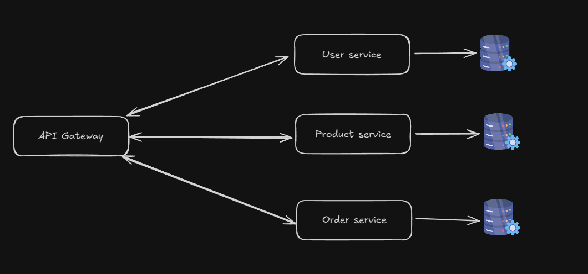

## Desgin

## Technology Using:

- Python
- FastAPI
- JWT
- Postgres
- Docker

## Component:

Currently, this project contains 4 services:

- Api Gateway
- User service
- Product service
- Order service

With a separate function, simulate an e-commerce project.

### API Gateway:

The API Gateway is responsible for managing:

- Request routing.
- Authentication & Authorization
- Rate Limiting
- ..

### User Service:

The User Service is responsible for managing all user-related functionalities, such as creating and storing user information. Additionally, it handles token generation for authentication purposes on the Gateway API.

### Product Service:

The Product Service is responsible for managing all product-related functionalities, such as creating and storing product information.

### Order Service:

The Order Service is responsible for managing all order-related functionalities, such as creating and storing order information.

## How to run the project
  1. using ^python3.8 and create a venv
  2. install the requirements:
        
    `pip install -r requirements.txt`
  3. start the database with docker:

    `docker run -d --name db -p 5432:5432 -e POSTGRES_PASSWORD=your_password -e POSTGRES_DB=user_db postgres:13`
  4. active the venv and start the services:

    `./start_service.ps1`
  5. connect to `localhost:8000` to access the Gateway API.