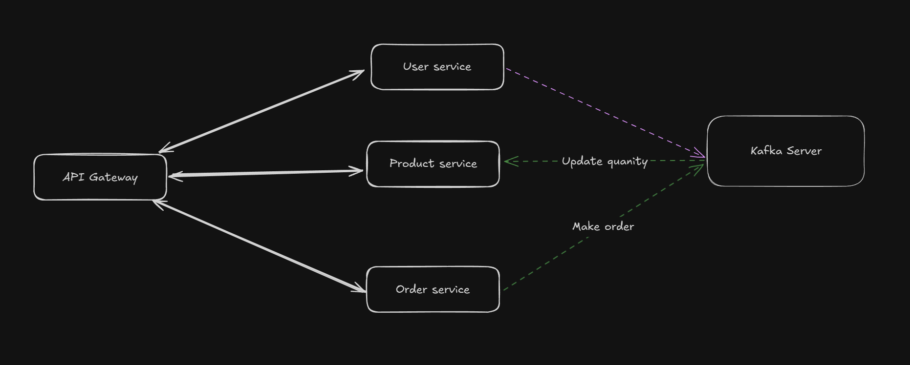

# Microservice

## Technology using:
 - Python
 - FastAPI
 - Postgresql
 - JWT
 - Docker/ Docker compose
 - 

## Services:
### 1. User service:
### 2. Product service:
### 3. Order service:
### 4. Gateway API:

## Apache Kafka:

Apply Apache Kafka to this project to process the service 
Work flow: 
